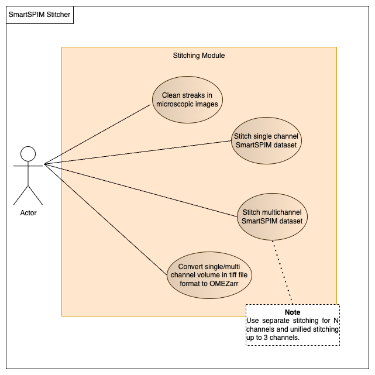
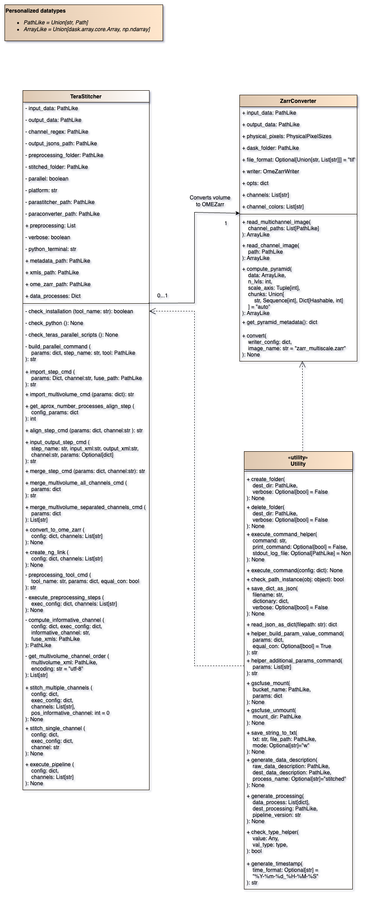

.. Doc Template documentation master file, created by
   sphinx-quickstart on Wed Aug 17 15:36:32 2022.
   You can adapt this file completely to your liking, but it should at least
   contain the root `toctree` directive.

Welcome to aind-smartspim-stitch:
=================================

This repository contains the image processing steps to process the SmartSPIM datasets 
acquired at the Allen Institute for Neural Dynamics (AIND). It is important to mention 
that this pipeline was designed to be used with cloud resources. The image processing 
steps used in this pipeline are: 

* **destriping**: This step cleans the streaks found in the tiles for each channel of the dataset. We are currently using a modified version of the Pystripe software that can be found in our GitHub account.
* **stitching**: This steps combines the dataset tiles for each channel using the overlapped fields of view that comes from the microscope. We are currently using the latest version of TeraStitcher software with some patches to the parallel scripts. This repository can be found in our GitHub account as well.
* **Image format conversion**: As today, we output images in .tiff format. However, this format is not cloud friendly. Therefore, we convert the whole brain volume with the multiple channels to the OME-Zarr format.
* **Visualization**: This package is not intended to visualize the processed SmartSPIM datasets. However, we include the generation of visualization links using neuroglancer.

Execution example
=================

An execution example in a Code Ocean capsule:

.. code-block:: bash

   python aind-smartspim-stitch/code/src/terastitcher.py --input_data path/to/dataset --preprocessed_data path/to/intermediate/data --output_data path/to/output/zarr

.. toctree::
   :maxdepth: 2
   :caption: Contents:

   modules

Use case diagram
================

.. note::
   The **normal flow** considers that the code is executed in Code Ocean, meanwhile 
   the **alternative flow** is being considered in specific situations for each use case.

.. list-table:: aind-smartspim-stitch use case diagram
   :widths: 25 75
   :header-rows: 1

   * - Use case
     - Description
   * - Clean streaks in microscopic images
     - Allows the destriping of the tiles per channel belonging to a dataset by using Pystripe software.
         **Normal flow**:
            1.	The actor triggers the SmartSPIM stitcher capsule.
            2.	The actor waits for the data to be cleaned.
         The **alternative flow** is considered in the cases where the actor does not want to clean the streaks.
            2A. The actor sets the parameter –preprocessed_steps.pystripe.execute to False.
               .. warning::
                  This feature only works with **.tiff** file format as image input.
   * - Stitch single channel SmartSPIM dataset
     - Allows the stitching of the tiles in a channel belonging to a dataset by using TeraStitcher software.
         **Normal flow**:
            1.	The actor triggers the SmartSPIM stitcher capsule. If the dataset contains only one channel, the single channel stitching will be automatically executed.
            2.	The actor waits for the data to be stitched and fused.

         The **alternative flow** is considered in the cases where the actor has a dataset with multiple channels but only needs to stitch one.
            1A. The actor sets the parameter –regex_channels to catch the desired channel using a regular expression.

   * - Stitch multichannel SmartSPIM dataset
     - Allows the stitching of the tiles in multiple channels belonging to a dataset by using TeraStitcher software.
         **Normal flow**:
            1.	The actor triggers the SmartSPIM stitcher capsule. If the dataset contains multiple channels, the multichannel stitching will be automatically executed.
            2. The actor waits for the data to be stitched and fused.

         The **alternative flow** is considered in the cases where the actor has a dataset with multiple channels but does not want to stitch all of them:
            1A. The actor sets the parameter –-regex_channels to catch the desired channels using a regular expression.
   
   * - Convert single/multi-channel dataset to OMEZarr format
     - Allows the format conversion from tiff to OMEZarr of the stitched and fused dataset.
         **Normal flow**:
            1.	The actor triggers the SmartSPIM stitcher capsule.
            2.	The actor waits for the data to be stitched, fused and converted to the OMEZarr format.

Use case diagram
================

In this diagram, the symbol **+** means that the property or method is public and **-** that it is private.
Additionally, we have defined some personalized datatypes in the top left corner.

Indices and tables
==================

* :ref:`genindex`
* :ref:`modindex`
* :ref:`search`
